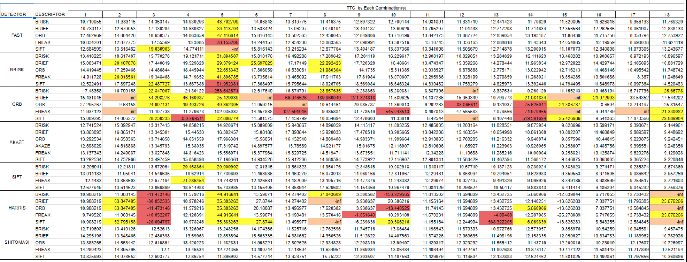

# SFND 3D Object Tracking:

With the knowledge from previous project on Keypoint Detectors, Descirptors, Matching and knowing how Lidar detection works, we levelled up further
in this project by utilising those informations to perform 3D tracking on objects. This invloves `(1)detection of objects in camera frame using YOLO- Deep learning framework`, `(2)associating the objects between each frames based on keypoint matches and bounding box we have`, `(3)Compute Median Distance ratio on the Keypoint matches to find camera based
TTC(Time TO COllision)`, and `(4)Clustering Lidar Points using bounding box between image frames to compute Lidar Only TTC`. Overall a great learning and yes its a lengthy course :D.

## Running the Project
- Run
    ```
    ./3D_object_tracking
    ```
- The command window shows options for choosing Detectors. Choose options [0-6] and press enter
    ```
    [0:FAST, 1:BRISK, 2:ORB, 3:AKAZE, 4:SIFT, 5:HARRIS, 6:SHITOMASI]
    ```
- Next the command window shows options for choosing Descriptors. Choose options [0-5] and press enter
    ```
    [0:BRISK, 1:BRIEF, 2:ORB, 3:FREAK, 4:AKAZE, 5:SIFT]
    ```
- Next the command window shows options for choosing Matchers. Choose options [0-1] and press enter
    ```
    [0:MAT_BF, 1:MAT_FLANN]
    ```
- Next the command window shows options for choosing Selectors. Choose options [0-1] and press enter
    ```
    [0:SEL_NN, 1:SEL_KNN]
    ```

I used MAT_BF and SEL_NN Selector combinations.

Following shows how I achieved each rubric points.

## FP.1 Match 3D Objects:
`matchBoundingBoxes()` method in `camFusion_Student.cpp` is implemented to associate bounding boxes based on keypoint matches between the frames. The logic involves choosing
only corresponding ROI(region of interest) holds the filtered and matched keypoints. Then we iterate the bounding boxes for both previous and current frame, to store the
number of matched keypoints captured in each combination of bounding boxes. The combination with max-counts of keypoints are grouped and returned as associated bounding box
in the form of map.

## FP.2 Compute Lidar-based TTC

The clustering logic for Lidar points is already implemeneted which involves transforming the lidar points to camera frame and group them based on ROI(bounding box) in camera frame. Also there is a shrink factor, which shrinks the grouped lidar points so that the outliers along th eedges which are prone to errors are neglected.

The `computeTTCLidar()` function is implemented in **`camFusion_Student.cpp`**. In the initial implementation, a **mean-based LiDAR point selection** approach was used for Time-To-Collision (TTC) estimation, which proved to be highly sensitive to noise and extreme outliers present in LiDAR measurements.

To overcome this limitation, an **Interquartile Range (IQR) based filtering technique** has been introduced. IQR-based filtering is a robust statistical method that removes outliers by analyzing the spread of the data rather than relying on central tendency, making it significantly less sensitive to noise and extreme values.
The IQR filtering steps involves:
//General fomula of IQR
- //Q1 - 25th percentile of sorted values
- //Q2- 50th percentile of sorted values
- //Q3 - 75th percentile of sorted values
- //IQR = Q3-Q1
- //lowerBound = Q1 - 1.5*IQR
- //higherBound = Q3 + 1.5*IQR
- The points which lies between the lower and higher bounds are more choosen for median computation.

After applying IQR filtering, the resulted LiDAR points are used to compute the **median distance** for both the previous and current frames. The median provides a stable and reliable representation of object distance and ensures consistent point selection across consecutive frames.
Finally, these median distances are used to compute the LiDAR-based TTC using
- TTC = CurrentDistance * DeltaT/(PreviousDistance - CurrentDistance)


## FP.3 Associate Keypoint Correspondences with Bounding Boxes
`clusterKptMatchesWithROI()` method in `camFusion_Student.cpp` is implemented. The logic follows, iterating all the keypoints in the bounding box and compute the euclidean distance with their corresponding matches in previous frame. Those keypoints are choosen, whose distance is approximately 1.2x closer to mean distance.These keypoints are then finalised for median distance ratio calculation for computing TTC.

## FP.4 Compute Camera-based TTC
`computeTTCCamera()` in `camFusion_Student.cpp` is implemented. Here the selected keypoints from FP.3 are taken and distance between one keypoint to everyother keypoints are computed for both current(disCurr) and previous frames(disPrev). Then the ratio (disCurr/disPrev) is calculated and finally their median is derived. This is called _Median Distance Ratio_ which is finally used  to calculate camera based TTC.


## FP.5 Performance Evaluation 1:

I have attached the TTC calculated by Lidar below. The LiDAR sensor provides accurate and smooth distance measurements, as evidenced by the gradual decrease in object distance over time. However, the TTC estimation is highly sensitive to how a representative point is selected from the LiDAR point cloud.
Although spatial outliers are reduced through ROI-based clustering, bounding box shrinking, and IQR filtering, the TTC calculation still relies on estimating relative velocity using distance changes observed over a short time interval (0.1 s).
As the graphs below states gradual decrease in distance, but the fluctuations in TTC is mainly due to the constant velcoity model assumption for entire remaining distance.
We just look at 0.1s time and calculate the relative velocity based on change in distance, but that velocity is assumed constant for actual current distance between the ego and preceeding vehicles. It is a strong assumption- Lot other factors come into play in real time , may be the ego vehicle can break , or preceeding vehicle can accelerate and move forward in the time. 
Also the TTC is inversely proportional to change in distance as and when the distance change is small, the TTC will be affected hugely.


## FP.6 Performance Evaluation 2
Since we have no ground truth data to verify, taking LiDAR TTC as an initial approximation to validate against the values generated for image based TTCs.

I have run all the possible detector-descriptor combinations and the results are attached in the spreadsheet. As you can see Detector types _FAST, BRISK and SIFT_
there are TTC values which really not in the true range. Sometimes the TTCs are in the ranges of (40, 70 and even 90s). Even though _SIFT_ is comparitively better among the
mentioned 3 detectors, still it shows the values in 20s which is not recommended. 



Comparing the rest, _ORB and HARRIS_ detectors, where the results are more erratic, as you can see the values in range of 500s for 10th image in _[ORB-SIFT]_ combination and
13th image of _[HARRIS+SIFT]_ combination.Some cases shows inf and negative values which are clearly due to poor selection of keypoints. Which is again not recommended.

Finally comparing _SHITOMASI and AKAZE_ - Gauging the values , I found SHITOMASI perfomed better as the change in values with respect to corresponding next frames are not 
that high and also considerably in the range compared to LiDAR and also on intutive understadning. Though the AKAZE perform secondly some values in the range of 17s are still
questionable. So I would choose *_[SHITOMASI + BRISK] or [SHITOMASI + ORB]_* combinations for TTC.


## Final Output - [SHITOMASI + BRISK] :

